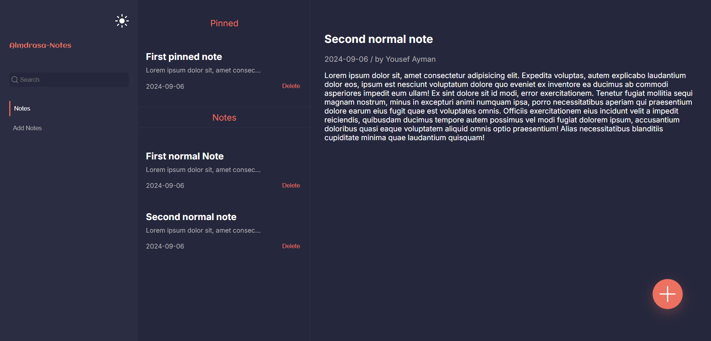

# Notes App

This is a fully responsive **Notes App** built using HTML, Sass, and JavaScript. The app allows users to create, pin, preview, delete, and search notes. Users can also switch between dark and light modes. All notes are saved in the browser's local storage, so they persist even after a page refresh.

## Features

- **Add Notes**: Users can create new notes and save them.
- **Pinned Notes**: Important notes can be pinned to the top of the list for easy access.
- **Delete Notes**: Users can delete notes if they are no longer needed.
- **Note Preview**: Click on any note to view the full content.
- **Search Notes**: Quickly find notes by typing in the search bar.
- **Dark and Light Mode**: Switch between dark and light modes for a better visual experience.
- **Local Storage**: All notes are stored in local storage, ensuring that notes are saved even after a page reload.
- **Responsive Design**: The app is fully responsive and works seamlessly on all device sizes.

## Technologies Used

- **HTML5**
- **Sass (CSS Preprocessor)**
- **JavaScript (ES6+)**
- **Local Storage API**
- **Node.js** and **NPM** for managing the development environment

## How to Use

### Running Locally

1. **Clone the Repository**:

   ```bash
   git clone https://github.com/Yussif20/note-app_js
   ```

2. **Navigate to the Project Directory**:

   ```bash
   cd note-app_js
   ```

3. **Install Dependencies**:

   ```bash
   npm install
   ```

4. **Run the App**:

   ```bash
   npm run dev
   ```

5. Open the provided URL (usually `http://localhost:5173`) in your browser to view the app.

### Live Version

You can also access the live version of the app without cloning the repository:
[Live Notes App](https://notes-app-dazai.netlify.app/)

## Features in Detail

- **Adding Notes**:

  - Click the "+" button at the bottom right of the screen or choose the add note tab.
  - Enter a title,author and description for your note.
  - Choose whether to add the note as a pinned or leave it as a normal note.

- **Viewing Notes**:

  - Notes are displayed with a short preview.
  - Click on any note to view the full content on the right panel.

- **Search Functionality**:

  - Start typing in the search bar to filter notes by their title.

- **Dark/Light Mode**:
  - Switch between dark and light themes using the toggle at the top of the sidebar.

## Screenshots



## Author

- Website - [Yusif Ayman](https://yussif20.github.io/main-portfolio/)
- linkedin - [Yusif Ayman](https://www.linkedin.com/in/yussif-ayman/)
- Github - [Yusif Ayman](https://github.com/Yussif20)
- Frontend Mentor - [Yusif ayman](https://www.frontendmentor.io/profile/Yussif20)
